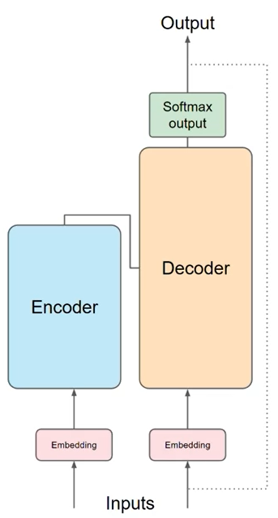
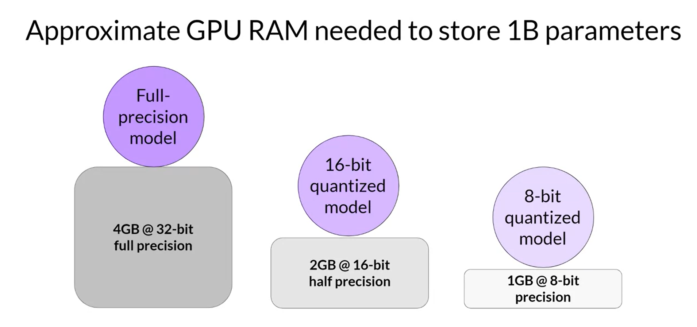
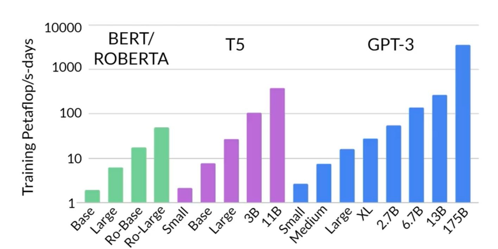
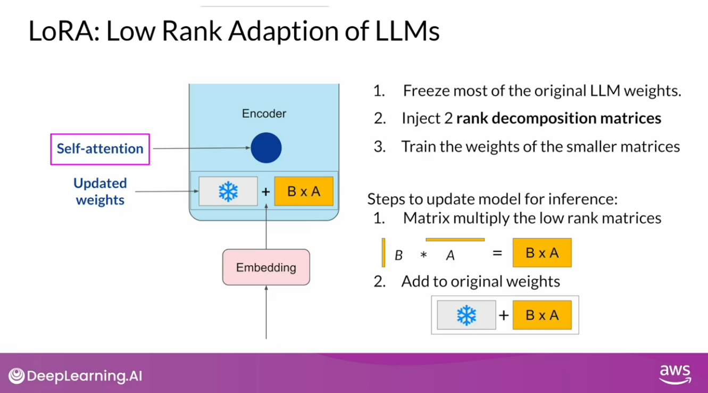

# 1. hét

https://www.coursera.org/learn/generative-ai-with-llms/home/week/1
## Generatív AI modellek és LLM-ek
* GPT
* PaLM
* LLaMa
* BLOOM
* BERT
* FLAN-T5

## Transformer architektúra

Transformer előtt: RNN, a megelőző szavakból prediktálja a következő szót.
A nyelv nagyon komplex, az egész szöveg értelmezése kontextusfüggő, ezért az RNN nem volt elég jó.

2017-ben a Google és a Torontó-i Egyetem kutatói publikálták a Transformer architektúrát.
* Skálázható
* Párhuzamos feldolgozásra képes
* Képes a kontextusfüggő szövegértelmezésre

A szavak közt attention weight-eket (figyelem súlyok?) képez az algoritmus. (self-attention)
### Működése:

Tokenizálni kell a szavakat előtte.
#### Embedding
Tokenekből vektorokat képez (eredetileg 512-es méretűeket)
#### Encoder és Decoder
Több rétegűek, és ezeken belül több self attention head is van, mind különböző dologra koncentrál a nyelven belül
(entitások, cselekvés, stb.), utánuk pedig feed forward network van kötve
#### Softmax output
Normalizálja a kapott vektort, valószínűségre leképezve minden szóra.

### Encoder
A bemenő inputot (promtokat) kódolja kontextussal együtt. 1 token 1 vektor lesz.
Vannak csak enkódoló architektúrák is, pl. BERT. Ezek klasszifikációra alkalmasak-
### Decoder
Input tokeneket kap és új tokeneket generál.
Vannak csak dekódoló architektúrák is, pl. GPT, Llama. Ezek generálásra alkalmasak.

## In Context Learning

A prompt engineering egyik módszere, hogy példákat adunk meg a promptban. Főleg kis modelleknél lehet rá szükség.
Típusok: zero-shot, one-shot, few-shot

## Konfiguráció
* max generált token
* top k sampling: a legvalószínűbb k token közül választ
* top p sampling: a legvalószínűbb tokenek közül választ, ahol ezek valószínűségének összege <= p
* temperature: a softmax outputot módosítja, kisebb érték esetén kevésbé random lesz a generált szöveg, nagyobb érték esetén pedig kreatívabb szöveget generál

## Projekt életciklus

### Scope
Milyen feladatot szeretnénk megoldani?
### Select
Létező modell vagy új modell kiválasztása
Általában létező modellt használunk, és finetune-oljuk
#### Tanítás
Hatalmas számítási igénye van, ezért csak nagyvállalatoknál van megfelelő infrastruktúra multi-GPU-s tanítások végrehajtására.
Kvantálás: 32 bites lebegőpontos számok helyett 16 bites lebegőpontos vagy 8 bites egész számokat.

Multi-GPU tanítás:
* DDP: Distributed Data Parallel
* FSDP: Fully Sharded Data Parallel
* ZeRO: Zero Redundancy Optimizer

Speciális, szaknyelvet igénylő feladatokhoz érdemes lehet saját modellt készíteni. (pl orvosi, jogi területek)
BloombergGPT: pénzügyi területre készített modell, kb fele-fele arányban pénzügyi és általános szövegekből tanították.

#### Skálázás
* Tanító adathalmaz növelése (tokenek száma)
* Modell méretének növelése (paraméterek száma)
* Fizikai megkötések: GPU-k száma, idő, költség

1 petaFLOP/s: 10^15 lebegőpontos művelet/s: a mértékegység a számítási teljesítményhez.
A tanításhoz ennyi ilyen napnyi tanításra van szükség:

Chinchilla projekt: adott budget-hez megtalálni a legjobb dataset méretet és paraméter számot.
Azt találták, hogy a GPT modellek túlparametrizáltak, viszont a adathalmazuk meg kisebb a kelleténél.
A kutatás eredménye, hogy a tanító adathalmaznak kb 20-szor akkorának kell lennie, mint a paraméterek számának optimális esetben.
Ez új kisebb, viszont hasonló képességű modellek készítéséhez vezetett.

### Fine-tuning
https://www.coursera.org/learn/generative-ai-with-llms/home/week/2
#### Instruction prompt
Prompt-completion párokat adunk a modellnek így javítva a teljesítményét. A teljes fine-tuning is nagyon költséges folyamat.
Prompt sablon könytárakkal előkészíthető az adathalmaz. A tanító adathalmazon futtatva a modellt frissítjük a meglévő súlyokat, a megfelelő eredmények elérése érdekében.
Instruct LLM-nek nevezzük a fine-tune-olt modellt.
Catastrophic forgetting: a modell "elfelejti" a korábban tanultakat, romlik az általános teljesítménye.

Multi-task fine-tune:
Elkerülhető vele a catastrophic forgetting, de sokkal több adat szükséges hozzá.

#### PEFT
Parameter Efficient Fine-Tuning:
A paraméterek csak egy kis részére koncentrál vagy újabb rétegeket ad a meglévő modellhez, és azon nem változtat.

Típusok:
* Szelektív: a meglévő rétegek egy részét használja
* Újraparaméterezés: újraparametrizálja a  modell súlyokat alacsony szintű reprezentációk használatával (pl LoRA)

  LoRA: Low-Rank Adaptation of LLMs: kevésbé jó, mint a teljes fine-tuning, de sokkal gyorsabb és olcsóbb is.
  

* Additív: új rétegeket, paramétereket ad a meglévő modellhez
  * Adapter: Encoder vagy Decoder rétegek közé ad új rétegeket
  * Soft prompt: a promptot módosítjuk pl: Prompt Tuning
    
    Prompt Tuning: virtuális tokeneket hozunk létre, ezekhez nem tartozik nyelvi elem.
    Nagy modelleknél kifejezetten hatékony, a teljes fine-tuninggal megegyező teljesítményt ad.

### Modell értékelése
Más-más feladatokra különböző metrikákat használunk.
* ROUGE: szöveg összegzésre
    
    Több fajtája is van 1, 2, ROUGE-L. Rossz válaszokra is tud jó pontszámokat adni. Megváltoztatott precizitással javítható ez, de nem teljesen kiküszöbölhető.
* BLEU: fordításra

    A ROUGE-hoz hasonlóan n-gram-ok alapján számol.

#### Benchmark eszközök
* GLUE: általános nyelvi feladatokra
* SuperGLUE: GLUE továbbfejlesztett változata
* HELM: 7 különböző szempont alapján tesztel
* MMLU: a nyelvi feladatokon felül tesztel
* BIG-bench: tudományos, szociális kérdésekben is teszteli

## Mojo
Új nyelv, típusos Pythonként is felfogható, de annál sokkal gyorsabbnak ígérik, a héten lett elérhető nyilvánosan.

https://www.modular.com/mojo
https://www.modular.com/blog/mojo-its-finally-here

