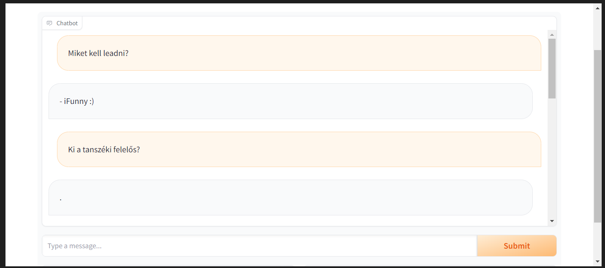

# 10. hét

## Azure deploy megoldása

https://techcommunity.microsoft.com/t5/iis-support-blog/a-quick-guide-to-publish-python-sdk-azure-bots-in-app-service/ba-p/3659026

Ez a link elvileg segítség, de ugyanazt a hibát kapom, mint a múltkor.

Microsoft App Password-öt nem is tudok generálni, "admin restriction" miatt. (Gondolom BME tiltás miatt.)

A hiba, ami miatt nem működik a dolog:


Érdekes, hogy az app.py mégis elindul:


Viszont a main rész már nem indul:

```python
if __name__ == "__main__":
    try:
        print("Starting app")
        web.run_app(APP, host="localhost", port=CONFIG.PORT)
    except Exception as error:
        raise error
```

Ha kiveszem az if-et, akkor lefut, de nem tudom elérni az appot. A Shutting down: Master és a Reason: App failed to load. hibaüzeneteket ugyanúgy megkapom.

UI.: lehet megvan a hiba oka:

A MicrosoftAppPassword lehet a gond és ID lehet a gond, (tehát az első link lehet működne, ha lenne MicrosoftAppPassword-öm)

https://stackoverflow.com/questions/74177322/bot-framework-emulator-works-but-web-chat-not-does-not


Ha tényleg ez a gond, szörnyű lenne, hogy több napot szenvedtem, és elment egy csomó idő -.-

VS Codeban leszedtem egy extension, amivel beállítottam a MicrosoftAppPassword-öt (portálon nem lehet de itt van újra lehetőség) és az első linket követve működik egy ideig, aztán leáll. (üdvüzlő üzenetet megkaptam)


UI UI: 

Működik

## Flask próba

Bár a Microsoftos framework is flaskra épül, elkezdtem egy sima flask appot írni, hogy megnézzem azzal jó lenne-e . Kiindulásként a framework json-ét vettem, hogy aztán az Azure bottal is működjön, illetve a Bot Framework emulatorral is tudjam tesztelni, de rájöttem, hogy ez most rengeteg időt venne igénybe, hogy ténylegesen, minden felhasználót és beszélgetést külön tudjon kezelni, meg chat előzményeket is figyelembe vegye, ezért elvetettem ezt az ötletet egyelőre.

A flask mappában látható a haladás. Ha a doksival jól haladok, akkor esetleg majd ránézek.

## Bot Framework Composer: alap Node bot létrehozása és publikálása

Létrehoztam a Bot Framework composerrel egy Node üres botot, majd publikáltam a porgramból, és a Bot Framework emulatorral is teszteltem. Lokálisan szintén műkődik (Köszönt, első üzenetként, majd mindig egy "Sorry, I didn't get that"-tel válaszol), Azure-ben ez se működik, ugyanúgy nem éri el az Azure bot a webapp-ot. (Utolsó ötletem, hogy a langchain Node library-jét használva megpróbálom, ha ez működött volna, de ez sem.)

Lokálisan emulátorral:


Azure:


## Fine-tune MT5

Kevés az adat, de van értelme, van köze a válasznak a kérdéshez.


training loss a következő paraméterekkel:
    
```python
training_args = TrainingArguments(
    output_dir=output_dir,
    learning_rate=1e-4,
    per_device_train_batch_size=16,
    per_device_eval_batch_size=64,
    num_train_epochs=10,
    weight_decay=0.01,
    logging_steps=1,
    max_steps=30,
)
```


Nem sikerült igazán megtalálni a megfelelő paramétereket.



Default értékekkel:


## Llama-2-7b-chat-hf

Fine tune nélkül:

Sikerül betölteni a modellt Colabben és gradioval elindítani, de perceken keresztül nem válaszol. Majd azt mondja, hogy nem tud válaszolni és a kapott dokumentumokat is hozzáfűzi a válaszhoz.


Megpróbálom ezt is fine-tunolni Colabon belül.

https://huggingface.co/docs/transformers/perf_train_gpu_one

Ezt használom segítségnek, mivel túl nagy a model és CUDA out of memory errort kapok a V100-as GPU-val.

```
CUDA out of memory. Tried to allocate 238.00 MiB. GPU 0 has a total capacty of 15.77 GiB of which 62.12 MiB is free. Process 260704 has 15.71 GiB memory in use. Of the allocated memory 14.33 GiB is allocated by PyTorch, and 393.91 MiB is reserved by PyTorch but unallocated. If reserved but unallocated memory is large try setting max_split_size_mb to avoid fragmentation.  See documentation for Memory Management and PYTORCH_CUDA_ALLOC_CONF
```

Ha ellhárítom az Out of memory hibát, akkor ezt kapom:
```
Expected input batch_size (640) to match target batch_size (1272).
```
Ez utóbbi azért van, mert ez egy text generation modell és nem egy text2text, mint a flan-t5 és mt5 is.