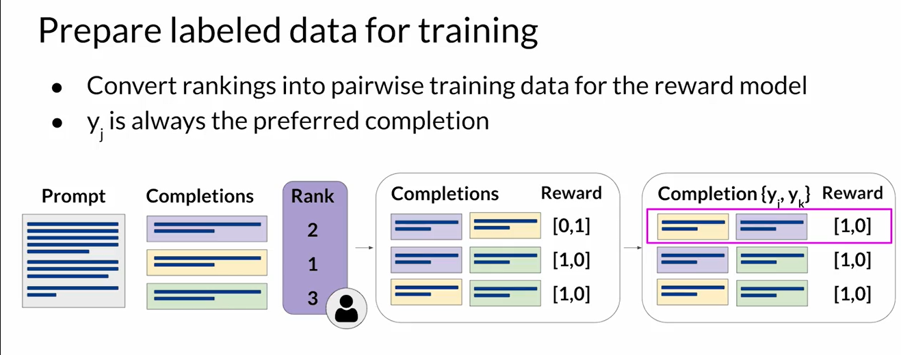

# 2. hét

https://www.coursera.org/learn/generative-ai-with-llms/home/week/3
## RLHF

Reinforcement Learning for Human Feedback (RLHF) - emberi visszajelzésre épülő megerősítéses tanulás
Tanulás során sértő, veszélyes  mintákat is megtanulhat. Ezek miatt káros, sértő válaszokat is generálhat a modell.

* Maximalizálni a segítőkészséget
* Minimálizálni a sértő, káros válaszokat
* Elkerülni a toxikus nyelvi kifejezéseket

### Reward modell

Adatok előkészítése tanításához:

Ez is nyelvi modell, binary classifier-ként használható minden prompt-completion párra.
Ad egy értéket, ezt felhasználva a RL algoritmus optimalizálja a modellt.

Egy ilyen algorithmus a PPO (Proximal Policy Optimization).

### PPO

Minden ciklus 2 részből áll

1. Completion-ök generálása
    jutalom (reward) és értékvesztés (value loss) számítása: a várható teljes jövőbeli jutalom és az aktuális jutalom különbsége
2. Modell frissítése
    Policy loss, entropy loss kiszámolása   
    A jutalom és értékvesztés alapján frissítjük a modellt, a "trust region"-ön belül tartja az update-t

Túltanulás ellen: KL-Divergencia korlátozása

## Integráció applikációba

### Optimalizálás

Fajták:

* Distillation:

    Egy nagy modellel tanítunk egy kisebbet, főként encoder-only modelleknél hatékony
* Quantization

    A súlyokat kvantáljuk kisebb bitmélységre, pl. 32-ről 16-ra
* Pruning

    A 0 és ahhoz közeli súlyokat elhagyjuk, így csökkentve a méretet

### Külső alkalmaazásokhoz kötés

RAG (Retrieval-Augmented Generation)

A retriever az a külső adatforrásokban rákeres a releváns adatokra, és összefűzi a kapott prompttal, így kapja meg az LLM.
Az adatokat sokszor érdemes vektorokként tárolni.

### Érvelés chain-of-thought-tal

Logikai feladatokat lehet megoldani, lépésről-lépésre lebontunk egy problémát.
One-shot inference-szel, beleírva a lépéseket, segíthetünk a modellnek.

### PAL

Program Aided Language Model (PAL): LLM + code interpreter

### ReAct

LLM + Websearch API

Egy orchestrator segítségével lehet automatikussá tenni a különböző egységek közti kommunikációt.
Ilyen például a LangChain.

## Architektúrai

## Tanítás egy GPU-n

https://huggingface.co/docs/transformers/perf_train_gpu_one

## Debugging Generative AI

https://learn.deeplearning.ai/evaluating-debugging-generative-ai/

wandb Python library segítségével, LangChain agent-et is követni tudunk vele.

## LangChain

https://learn.deeplearning.ai/langchain/

langchain Python library
* Prompt template-ek

* Modellek:  Alngchain képes kölünböző modelleket kezelni

* Response parser: az LLM válaszát megfelelő sémába alakítja, pl dictionary

* Memória egy chatbothoz:
  * ConversationBufferMemory: A követkeő promptba beleírja a korábbi üzeneteket
  * ConversationBufferWindowMemory: Csak az utolsó k darab üzenetváltást jegyzi meg
  * ConversationTokenBufferMemory: Csak az utolsó x tokennyit jegyzi meg
  * ConversationSummaryBufferMemory: Az eddigi üzenetek összefoglalóját jegyzi meg

* Chain: szekvenciaként összekapcsolja a különböző műveleteket
  * LLMChain: promptot az LLM-hez kapcsolja
  * SimpleSequentialChain: egy input/output, az egyik output a következő lánc inputja (pl: két LLMChain egymás után)
    
    
  * SequentialChain: több input/output

    
  * RouterChain: feltételes ágakat hoz létre

    
  * MultiPromptChain: többféle pormpt sablon közti route-oláshoz jó
  * RetrievalQA: saját dokumentumokból keres a válaszokhoz 
  
    Embeddingek vektorokat használ, a szöveget leképezi vektorokká és ahhoz közelieket keres az előtte elkészült vektor adatbázisban.
  
    Változatok sok dokumentum esetére:
    

* Értékelés:
  * Generáltathatunk a dokumentumok alapján kérdés-válasz párokat
  * QAEvalChain: egy LLM segítségével értekelhetjük a kapott eredményeket, mindegyik példára
  * LangChain Evaluation Platform: vizualizálja az értékeléseket

* Agents

  Az LLM-t "reasoning engine"-ként használjuk, az agentek külső szolgáltatásokhoz tudják kötni (keresőmotor, API, Python interpreter, stb)
  és eldönti, melyiket használja. Saját tool-t is létre lehet hozni
  
https://learn.deeplearning.ai/langchain-chat-with-your-data/
### Document Loader-ek

Különböző típusú adatokat tudnak betölteni: CSV, JSON, PDF, stb.
Lehetnek strukturáltak vagy struktúrálatlanok, publikusak vagy sajátok is.

### Document Splitting

Chunkokra lehet bontani a dokumentumokat: méretet és overlap-et lehet állítani.

Splitter fajták:
* CharacterTextSplitter: karakterenként bontja
* MarkdownHeaderTextSplitter: markdown fejlécek alapján bontja, extra metadata-t is ad
* TokenTextSplitter: tokenek alapján bontja
* SentenceTransformersTokenTextSplitter: szintén tokenek alapján bontja
* Language: programnyelvekhez használható
* SpacyTextSplitter: Spacy-t használja, hogy a mondatokat bontsa
* NLTKTextSplitter: NLTK-t használja, hogy a mondatokat bontsa
* RecursiveCharacterTextSplitter: rekurzívan bontja a karakterek alapján, mindig másikat választva

### Vectore store

A chunkokat vektorokká alakítja, és egy adatbázisban (pl: Chroma) tárolja.

### Retrieval

Szélső esetek lehetnek, pl rossz splitting miatt

* MMR: 'fetch_k' darab eredmény, ezek közül a k darab legkülönbözőt választjuk ki
* Self Query: LLM-et használva a kérdést szétbontjuk pontosabban tudunk keresni a vektoradatbázisban
* Compression: LLM-mel tömörítjük a válaszokat a csak releváns infókra, majd ebből választunk

### Válaszgenerálás
1. Map reduce: a különböző chunkokat külön-külön megválaszoljuk, majd a modell választ ezek közül is
2. Refine: a különböző chunkokat hozzáfűzzük az előzőre kapott válaszhoz
3. Map_reank: a különböző chunkokat külön-külön megválaszoljuk és ezekhez számértéket rendelve a legjobbat választjuk

Memóriával a chat előzményeket is használjuk.

ConversationalRetrievalChain: az LLM-hez és a memóriához vektoradatbázist is kapcsol.
