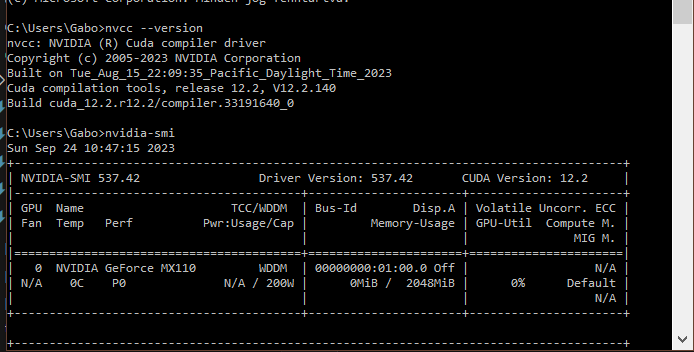
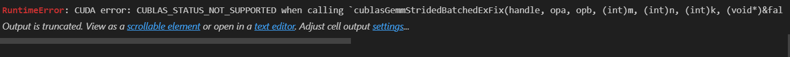

# 3. hét

Hasznos repo lehet: https://github.com/oroszgy/awesome-hungarian-nlp

## Puli GPT-3SX
Kipróbálható: https://juniper.nytud.hu/demo/puli

egyszerű utasításra, kérdésre se ad megfelelő választ

szövegek folytatására alkalmas, de arra se igazán megbízhatóan alkalmazható

few-shot inference:

Utóbbi kettő az oldal példa promptjai közül vannak, de ezek se megbízhatóak

## Puli GPTrio

https://huggingface.co/NYTK/PULI-GPTrio

Ez már magyar és angol szövegen is volt tanítva, az eredményei is jobbak. Megpróbálja a feladatot elvégezni, nem feltételen jó válaszokat ad azonban.

Kipróbálható: https://juniper.nytud.hu/demo/gptrio

 A húslevesrecept egész jó, pár paraméterállítás után:

Helyi futtatás esetén ilyen errort kapok:

Google colab esetén hasonló hiba:

## Magyar sentence transformer

https://huggingface.co/NYTK/sentence-transformers-experimental-hubert-hungarian

## Fine-tuned huBERT

https://huggingface.co/mcsabai/huBert-fine-tuned-hungarian-squadv2

A modell megfelelő kontextus esetén helyesen válaszol a kérdésekre, hasznos lehet nekünk.

Több kérdést egyszerre nem tud megválaszolni, kisebb magabiztosággal válaszol az egyikre:

Több:

Egy:

## CUDA problémák
Feltelepítettem a CUDA-t, de a laborban a `torch.cuda.is_available()` függvény `False`-t ad vissza. A `nvidia-smi` parancs viszont megfelelően működik, a `nvcc --version` parancs pedig azt írja, hogy a CUDA 12.2 van telepítve.

sikerült megoldani, hogy lássa, de most futtatás közben a következő hibaüzenetet kapom:

## Szakmai Gyakorlat források

A resources.md-ben találhatóak