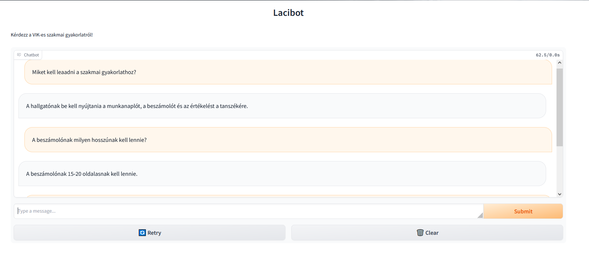

# 6. hét

## Gradio

Gradio segítségével egy chatfelületet alakítottam ki, ahol lehet tesztelni a chatbotot

## Langchain

ConcersationBufferedWindowMemory és ConversationalRetrievalChain használatával készítettem el a chatbotot, mely egyelőre nem tud túl jó eredményeket adni.

Jelenleg:

Paraméterek:
- generált kérdsések nélkül
- MMR, k= 5, top_k=10
- tempretature=0.4, max_token = 500
- memory, k=3
- text splitter paraméterek:

Más paraméterekkel, illetve alap lánc elemekkel és saját prompttal is jobb lehet az eredmény.

## Teszt rész kialakítása a notebookban

testing mappában txt-ben tesztkérdések, ezeket beolvasni és relevant score-okat kiszámolni, majd ezeket kiírni egy táblázatba.

Következtetés: rengeteg hasonló kérdés van még a reviewed question csv-kben -> ezeket szelektálni vagy átfogalmazni kell
(vagy csak többször kerültek be a vektoradatbázisba, mert annak törlése és újragenerálása után nem találtam annyi hasonlót már)

A tesztek eredméyneit a testingen belül a paramétereknek megfelelően elnevezett fájloknál vannak.
matplotlibbel mindegyikhez készíthető egy diagram is, amin csoportosítva láthatjuk a teszteknél kapott találatokhoz a relevance score-okat.

## lacibot.py

Ezt a Python szkriptet futtatva lehet a chatbottal beszélgetni Gradion UI-on keresztül. Ha van már a res/chroma mappában adatbázis, akkor azt használja, ha nincs, akkor generál egyet. a res/in_use mappa fájljaiból.