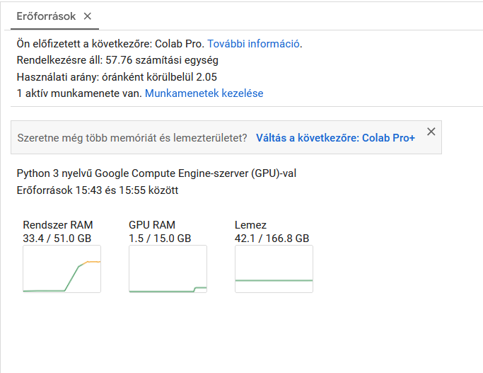
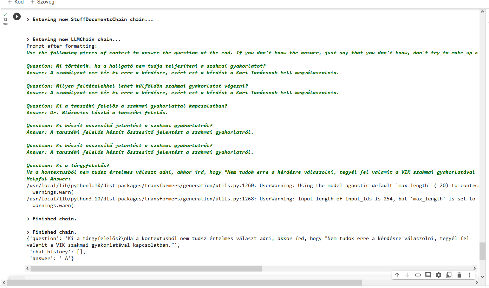

# 7. hét

Elérni, hogy magyarul válaszoljon minden kérdésre:
* Promptba beleírni a kérdés után: részben sikeres, de nem tökéletes, normál üzentekre is mindenképp a kontextus alapján akar válaszolni
* Saját promptokat csinálni a jobb hatékonyság érdekében: jobb eredményeket ad

### Puli-GPTrio Colabon belül

Ennyi erőforrást igényel ugyanaz a Langchaines program:

A "Ki a tárgyfelelős?" kérdésre egy A betűvel válaszol:

sentence transformers különböző embeddingjeivel próbálkoztam, de nem adtak túl jó eredményeket a magyara nyelv miatt feltehetően, ezért visszaváltottam az OpenAIEmbeddingre, mert az legalább jó kontextust talál.

Fine tune:

Kiinduló alapnak a DeepLearningAI-os kurzust vettem.

A fine tune-hoz tokenizáltam a kérdéseket és a válaszokat. Létrehoztam tanító, validációs és teszt adathalmazt is belőle (egyelőre nem volt túl sok)

Először a full fine tune-t próbáltam meg, de a különböző paramétereket még nem sikerült megtalálni, hogy le is fusson a dolog.

Peft: szintén az a probléma, hogy más típusú a modell és hiányzanak belőle a default beállításhoz tartozó dolgok, emiatt még ezt se sikerült megoldani.

### Hubert

Létrehoztam az eddigihez hasonlóan a RAG architektúrát, de csak az utolsó lépésben használom ezt, a chat előzményekből és új kérdésből egy konkrét kérdés generálására egy másik modell kell (ez most a GPT-3.5), mert ez csak question-answeringre van kitalálva.
A ChatGPT-s verzió viszont sokkal összetettebb válaszokat ad, ez csak pár szót.

### Embeddingek

A vektoradatbázishoz használt embeddingekre kerestem szintén másik, open-source opciót. A sentence transformerekkel próbálkoztam az eddigi OpenAIEmbedding helyett, mert ezeket már használtam korábban és egész jó eredményeket adott angol nyelvre. Itt viszont a magyar nyelv ismét megmutatja, hogy mennyire egyedi, mert hiába multilingual, azért nem annyira releváns opciókat ad, mint az eddigi megoldás