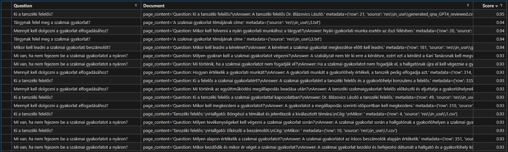

# 8. hét

### Hubert előzményekkel a kontextusba: 

Nem jó, csak azzal, nem jó megoldást ad

## Teams-es integráció

### Power Virtual Agents

https://learn.microsoft.com/en-us/power-virtual-agents/publication-add-bot-to-microsoft-teams

Power Virtual Agents-sel lehet chatbotokat csinálni, kifejezésekre ad, meghatározott válaszokat Topicokkal. Folyamatábra-szerűen lehet építeni, hogy milyen válaszokat adjon. Ez az eddigi munkát tök feleslegessé teszi, mert teljesen máshogy kell építeni a chatbotot, de működhetne.

https://learn.microsoft.com/en-us/microsoftteams/platform/bots/what-are-bots

### Bot Framework

https://stackoverflow.com/questions/60269902/how-to-build-a-python-bot-for-teams-how-to-deploy-the-same-in-my-prod-server

Eszerint a stackoverflow kérdés szerint a Bot Framework-öt kell használni, amihez a Teams SDK-t kell használni. A Bot Framework-öt lehet Pythonban is használni, de a Teams SDK csak C#-ban van.

https://dev.botframework.com/

https://learn.microsoft.com/en-us/azure/bot-service/bot-service-quickstart-create-bot?view=azure-bot-service-4.0&branch=Ignite2018&tabs=python%2Cvs#prerequisites

## Embedding-ek összehasonlítása

Az eredmények a testing/embedding mappában találhatók.

### OpenAI

Mivel többnyelvű modellel dolgozik, jó értékeket kapunk, természetesen a kérdéshez is ténylegesen kapcsolódnak a dokumentumok

### Sentence Transformers

Többnyelvű sentence transformert használtam, először véletlen egy kizárólag angol nyelvűt használtam, ami relevance score-ban egy 10 %-kal rosszabb számértékeket adott, de a tényleges megtalált dokumentumok nem kapcsolódtak a kérdéshez.

Ahogy látható a sentence_tran_k5_size500.csv-ben, a többnyelvűség se igazán segít ebben (relevancia szerint rendezve):

### Instructor embedding

Elvileg angol nyelvű modell, de más típusa miatt ki akartam próbálni. Instruct embedding, tehát meg lehet mondani neki, hogy milyen szempont szerint képezze vektorokra a mondatokat. Az relevance score még magasabb is, mint az OpenAIEmbedding-nél, mégis úgy érzem, nem teljesen a kérdéshez kapcsolódó dokumentumokat találja meg. A Sentence Transformer modellnél viszont jobb megoldásokat talál, így egy ingyenes megoldás lehet egy gyengébb, de olcsóbb chatbothoz.

## Megoldások összehasonlítása

A testing/models mappában az eredmények.

### OpenAI

A legjobb eredményeket adja, hiszen ez a legnagyobb modell. Az önálló kérdéseknél jól teljesít, a chatesnél a gond néha az, hogy a kérdést újrafogalmazza, úgy, hogy nem arra találunk rá, amire kéne, vagy új dolgot is belerakott. Ezen próbáltam javítani a prompt változtatásával, pl hogy ne rakjon bele új kérdést, de így se tökéletes. Pl:

### Hubert, OpenAI Embedding-gel

Nem egész mondatokban válaszol. Kevésbé hatékony, párszor az EvaluationChain is rosszul értékeli a választ. Összefüggő beszélgetésnél már jelentősen rosszabb eredményt ad.

### Hubert, Instructor Embedding-gel

Az EvaluationChain még rosszabbul működik itt (fogalmam sincs, mi lehet az oka, 2 mondatot kell csak összehasonlítania), mint az előbb. Ez a modell nem jó erre a feladatra. Hiába volt az embedding jobb a sentence transformerénél, uyganúgy nem túl jó a magyar nyelvhez.

## Többnyelvű HuggingFace modellek

### ai-forever/mGPT

https://huggingface.co/ai-forever/mGPT

1.3 milliárd paraméteres, ez is csak 1-1 karaktert generál. Nem értem, miért.
EvalChain értékelését itt már elengedtem.

### meta-llama/llama2-7b

https://huggingface.co/meta-llama/Llama-2-7b

Kértem elérést, de még nem kaptam meg. Ha kapok, mindenképpen szeretném ezzel is kipróbálni a 7 milliárdos változattal a Colabon belül.

### Photolens/llama-2-7b-langchain-chat

https://huggingface.co/Photolens/llama-2-7b-langchain-chat

Ugyanaz a probléma, mint az mGPT-vel, csak 1 karaktert generál. (Lehet nálam van a gond???) Colaben és helyben is.

### google/mt5-base

Fine tunolni kell, de megfelelő lehet azután, sikerült is a kis adathalmazzal, növelni kéne még azt és utána megpróbálni.
