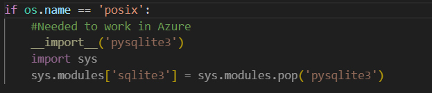
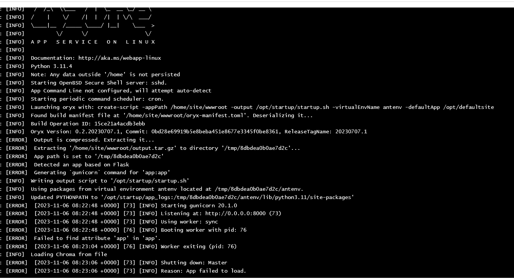

# 9. hét

## Bot framework

Útmutató szerint bot projekt létrehozása majd bot framework emulatornál teszteltem, hogy létrejött. Ezután a saját botomra kell átírni.

ActivityHandler:a bot különböző eseményekre tud reagálni, ha ebből az osztályból származik és felülírja a megfelelő metódusokat.

TurnContext: a bot és a felhasználó közötti kommunikációért felelős, egy oda-vissza üzenetváltás.

Dialógusok: komplexebb párbeszédekhez, pl. több lépéses pizzarendelés 

https://learn.microsoft.com/en-gb/training/modules/design-bot-conversation-flow/4-activity-handlers-and-dialogs

A Minta projektek alapján elkezdtem összerakni egy korábbi beszélgetést is figyelembe vevő chatbotot.

Állapotot tároló mintakód:
https://github.com/microsoft/BotBuilder-Samples/tree/main/samples/python/45.state-management

Ehhez módosítani kellett az eddigi memórián is, mert az nem külön emberekre tárolta így az előzményeket, hanem a beérkezetteket egymás után. hiába a más felhasználó.

Bot deployolása:

https://learn.microsoft.com/en-gb/azure/bot-service/provision-and-publish-a-bot?view=azure-bot-service-4.0&tabs=multitenant%2Cpython

Azure Linux Python környezetben probléma volt az sqlite3-mal, megoldás: 

Hétfő reggeli log (tegnap este még más volt):

